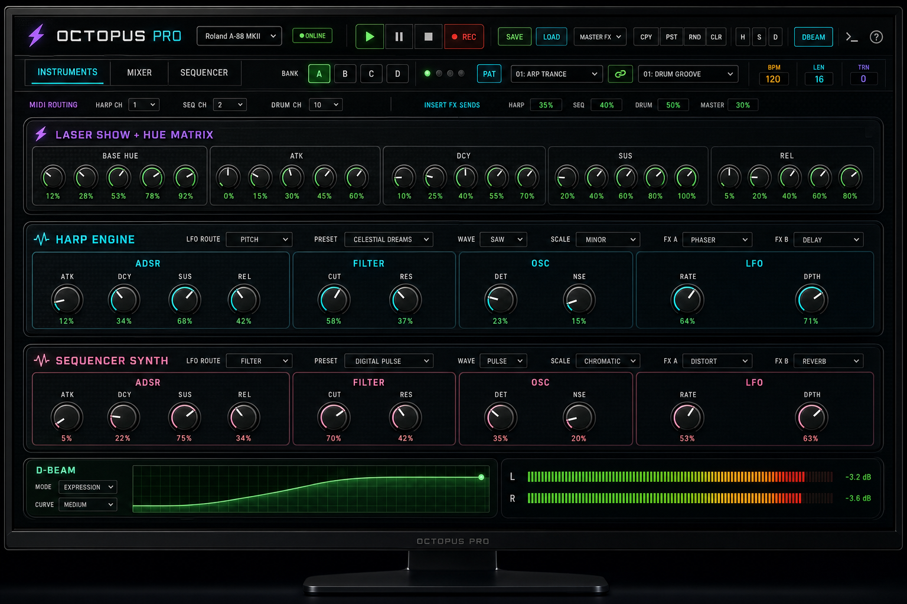
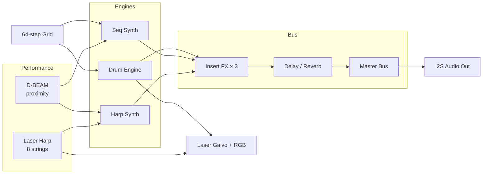

# Octopus PRO XL v6.0

**Laser Harp Groovebox — Firmware & Companion Application**



| | |
|---|---|
| **Version** | 6.0.01 |
| **Platform** | ESP32-S3 (dual-core, FreeRTOS, ESP-IDF 5) |
| **Author** | DIODAC ELECTRONICS / [iSystem](https://isystem.app) |
| **Launch App** | **[octopus.isystem.app](https://octopus.isystem.app)** |
| **Product site** | **[octopus-info.isystem.app](https://octopus-info.isystem.app)** |
| **Source code** | **[GitHub](https://github.com/iSystemDevelopment/Octopus_PRO_XL_v6.0)** |
| **Documentation** | [User Manual](./user_manual.md) · [Deployment](./DEPLOYMENT.md) · [Changelog](./CHANGELOG.md) |

---

## Live links

| Resource | URL |
|----------|-----|
| **OctopusApp** (Web MIDI console) | [https://octopus.isystem.app](https://octopus.isystem.app) |
| **Product / info site** | [https://octopus-info.isystem.app](https://octopus-info.isystem.app) |
| **GitHub repository** | [github.com/iSystemDevelopment/Octopus_PRO_XL_v6.0](https://github.com/iSystemDevelopment/Octopus_PRO_XL_v6.0) |
| **Facebook** | [facebook.com/diodac.co.uk](https://www.facebook.com/diodac.co.uk/) |
| **User manual** | [user_manual.md](./user_manual.md) |
| **Architecture** | [code_info.h](./code_info.h) |
| **Maintainer roadmap** | [Upgrade.md](./Upgrade.md) |

> GitHub Pages (optional mirror): enable Actions deploy — see [DEPLOYMENT.md](./DEPLOYMENT.md).  
> Production product site: **octopus-info.isystem.app** on VPS.

---

## Overview

Octopus PRO XL is a performance-oriented **laser harp** and **groovebox** that integrates real-time laser projection, polyphonic synthesis, a 64-step sequencer, TR-style drum synthesis, proximity expression (D-BEAM), and a shared effects bus — in a single embedded instrument operable from a minimal hardware surface or a full USB companion editor.

The system is designed for **stage use without a laptop**: the OLED, rotary encoder, and two buttons provide complete access to sound design, pattern editing, song chaining, and persistence. When connected, **OctopusApp** at [octopus.isystem.app](https://octopus.isystem.app) exposes the same parameter model over USB MIDI SysEx, with hardware retaining exclusive control of transport (play, stop, record arm, tempo).



---

## Key capabilities

| Domain | Specification |
|--------|----------------|
| **Harp** | 8 laser strings, 16 scales, 3 play modes (POLY8 / STRINGS / SOLO), BPM-synced arpeggiator |
| **Sequencer** | 64 steps × 16 rows (8 melody + 8 drums), 4 banks (A–D), P-lock motion (4 lanes) |
| **Song mode** | 16 song slots, up to 16 chain steps (bank + repeat count) |
| **Sound library** | 128 factory presets, 64 user slots per engine (harp + seq), 64 user pattern slots |
| **Drums** | 8 voices, 4 kit characters (TR-909, TR-808, Trap, House), global pitch |
| **Effects** | 16 insert FX-A, 16 dynamics FX-B, 16 master presets, shared delay/reverb aux |
| **Expression** | D-BEAM ADC with 5 response curves, routes to harp or melody synth (local DSP only) |
| **Connectivity** | USB MIDI + SysEx (Web MIDI in browser); no DIN MIDI in v6.0 |
| **Persistence** | Scoped save/load/reset to NVS (full, banks+patterns, motion, settings) |

---

## Quick start

### Hardware-only

1. Power the unit via USB.
2. **SCALE** (long) — switch HARP / SEQUENCER dashboard.
3. HARP: **SCALE** = scale; encoder = presets; **OC** (long) = open laser gate.
4. SEQUENCER: encoder = BPM; **SCALE** = play/stop.
5. Long encoder press → **SAVE** before power-off.

### With OctopusApp

1. Open **[octopus.isystem.app](https://octopus.isystem.app)** in Chrome or Edge (HTTPS required for Web MIDI).
2. Connect USB, click **CONNECT**, authorize the Octopus device.
3. Edit patches, grid, mixer, and song chains in the App.
4. Use **hardware** for play/stop, record arm, and tempo.

See [User Manual §3.4](./user_manual.md#34-app-connected-mode) for App-connected hardware behaviour.

---

## Repository layout

| Path | Description |
|------|-------------|
| `Octopus_PRO_XL_v6.0.ino` | Boot kernel, task scheduling |
| `harp.cpp` / `groovebox.cpp` / `effect.cpp` | Instrument engines |
| `OctopusApp.html` | Web MIDI console → deploy to **octopus.isystem.app** |
| `octopus_web.html` | Product site → deploy to **octopus-info.isystem.app** (or GitHub Pages mirror) |
| `user_manual.md` | End-user documentation |
| `code_info.h` | Developer architecture manifest |
| `deploy/` | VPS nginx config + deploy scripts |
| `.github/workflows/pages.yml` | GitHub Pages automation |

---

## Building firmware

**Requirements:** Arduino IDE 2.x or arduino-cli, **ESP32-S3** board support (ESP-IDF 5.x), libraries:

- ESP32Encoder  
- Adafruit GFX + Adafruit SH110X  

**Steps:**

1. Open `Octopus_PRO_XL_v6.0.ino` (all `.cpp` / `.h` in the same folder).
2. Select ESP32-S3 board matching your module (flash / PSRAM).
3. Use `partitions.csv` and `sdkconfig.defaults` per your board package.
4. Compile and upload via USB.

Consult **`code_info.h`** before changing SysEx commands or persistence.

---

## Deployment

| Target | Guide |
|--------|--------|
| Product site (VPS) | [DEPLOYMENT.md §3](./DEPLOYMENT.md#3-vps--product-site-at-octopus-infoisystemapp) |
| OctopusApp (VPS) | [DEPLOYMENT.md §4](./DEPLOYMENT.md#4-vps--octopusapp-at-octopusisystemapp) |
| GitHub Pages (mirror) | [DEPLOYMENT.md §1](./DEPLOYMENT.md#1-github-repository-setup) |

Quick VPS deploy (PowerShell):

```powershell
.\deploy\deploy-web.ps1 -Remote "user@your-vps" -CreateDir   # product site
.\deploy\deploy-app.ps1 -Remote "user@your-vps" -CreateDir  # OctopusApp
```

---

## Contributing & support

- [CONTRIBUTING.md](./CONTRIBUTING.md) — issues, authorized PRs  
- [SECURITY.md](./SECURITY.md) — vulnerability reporting  
- [CHANGELOG.md](./CHANGELOG.md) — release history  
- GitHub Issues — include firmware **`6.0.01`** (or `SYSTEM_FW_VERSION` from Serial boot), App connected Y/N, repro steps  

See [**CHANGELOG.md**](./CHANGELOG.md) for the full **6.0.01** fix list (FX, clicks, stuck notes, arp patterns).

| Link | URL |
|------|-----|
| GitHub | [github.com/iSystemDevelopment/Octopus_PRO_XL_v6.0](https://github.com/iSystemDevelopment/Octopus_PRO_XL_v6.0) |
| Facebook | [facebook.com/diodac.co.uk](https://www.facebook.com/diodac.co.uk/) |

---

## License

© 2026 **DIODAC ELECTRONICS / iSystem**. All rights reserved.

Proprietary software — see [LICENSE](./LICENSE). Viewing this repository does not grant redistribution or modification rights without written permission.

---

**Related reading:** [System Architecture](./user_manual.md#2-system-architecture) · [Arpeggiator Patterns](./user_manual.md#72-arpeggiator-pattern-reference) · [Effects Reference](./user_manual.md#74-effects-architecture--character-guide)
