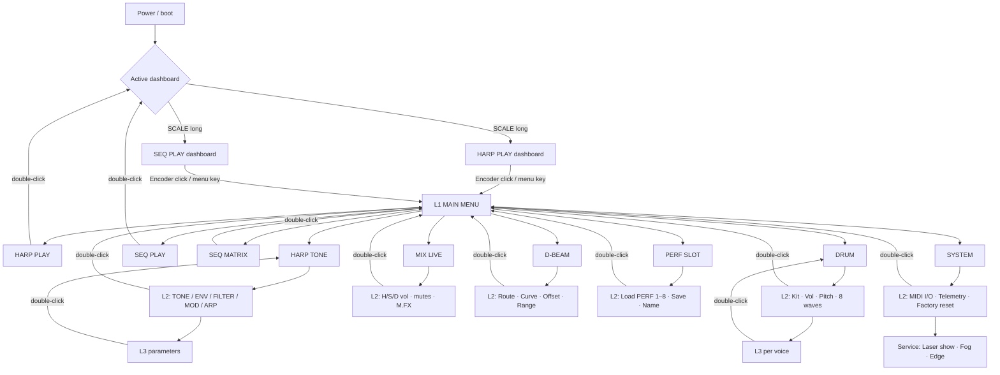
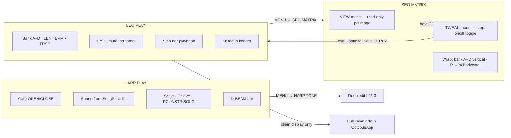
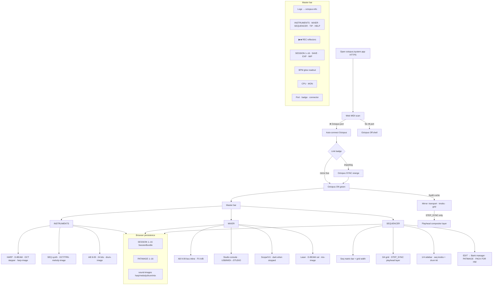
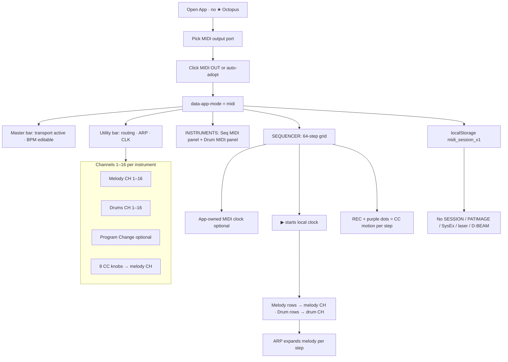

# UI flowcharts — Hardware OLED · OctopusApp · MIDI mode

**Build reference:** Firmware **6.1.01** · OctopusApp **6.6.01** · June 2026  
**Normative hardware wireframe:** [`oled_ui_wireframe_v6.6.md`](oled_ui_wireframe_v6.6.md)  
**Normative App inventory:** [`v6.3.00.md`](../v6.3.00.md) §14.4  
**Transport / playhead:** [`mirror_architecture.md`](mirror_architecture.md) (DSP) · [`playhead_policy_audit.md`](playhead_policy_audit.md) (DSP + MIDI verification)

---

## 1. Hardware — menu navigation

Encoder turn = move cursor · click = enter/confirm · double-click = back to parent · **SCALE** / **OC** = context actions on dashboards.

| Gesture | Any screen |
|---------|------------|
| Encoder turn | Move selection / adjust value (L3) |
| Click | Enter submenu or confirm L3 edit |
| Double-click | Back one level (L3→L2→L1→dashboard) |
| SCALE (dashboard) | Scale / panic (HARP) or play-stop (SEQ) |
| OC long (HARP) | Laser gate open/close |
| OC short | Play mode / record arm (context) |

---

## 2. Hardware — performance surfaces & matrix

Two surfaces users live in during a gig; matrix is the patimage faceplate.

| Mode | Matrix cells | Edit authority |
|------|----------------|----------------|
| **VIEW** | Show `hwSeqData` / SongPack patimage | Hardware read-only |
| **TWEAK** | Toggle step on/off | RAM → optional PERF save on exit |
| **App SEQUENCER** | Full 64×16 editor | Browser SESSION / PATIMAGE 1–16 |

**Not on hardware L1:** song chain editor, SESSION 1–16 names, full synth walls, App-only automation.

---

## 3. OctopusApp — extended studio flow (v6.6)

Octopus-first shell. MIDI Controller UI deferred in 6.6 but code path remains.

| Layer | User action | Storage |
|-------|-------------|---------|
| **SESSION** | SAVE / EXP / IMP | `octopusapp_session_bundle_v1` |
| **PATIMAGE** | SAVE on seq bar / slot 16 demo | `octopusapp_patimage_v1` |
| **Sound image** | IMG + dropdown recall | `octopusapp_sound_images_v1` |
| **Device PERF** | PACK FOR HW → SongPack | Device NVS (not browser) |

Factory tutorials: **HELP → Reload tutorial examples** · **PATIMAGE 16** · see [`examples/octopusapp/README.md`](../examples/octopusapp/README.md).

---

## 4. OctopusApp — MIDI Controller mode

> **v6.6.01:** MIDI Controller pulpit is **shipped** — unplug ★ Octopus or pick a non-★ port. HELP → **OCTOPUS MIDI CONTROLLER** for setup.

| Setting | Default | Range |
|---------|---------|-------|
| Melody channel | 1 | **1–16** |
| Drum channel | 10 (GM convention) | **1–16** |
| Melody PC | 0 | 0–127 |
| Drum PC | 0 (optional) | 0–127 |
| Drum notes | GM map 36,38,… | per-row editable |

**Octopus vs MIDI:** never both active — ★ port forces Octopus mode and tears down MIDI clock.
