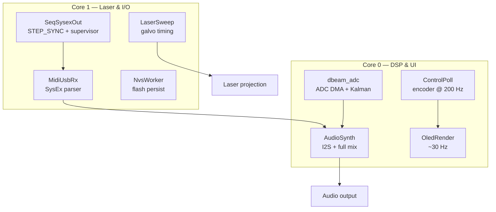
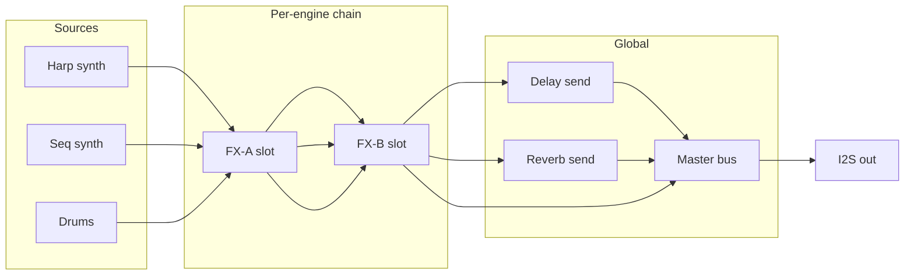
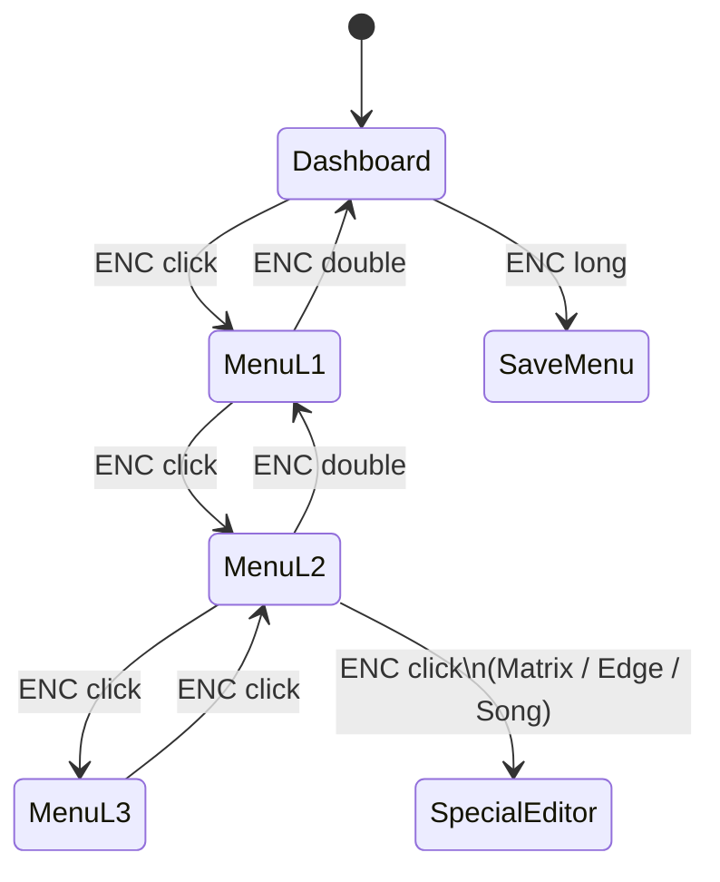
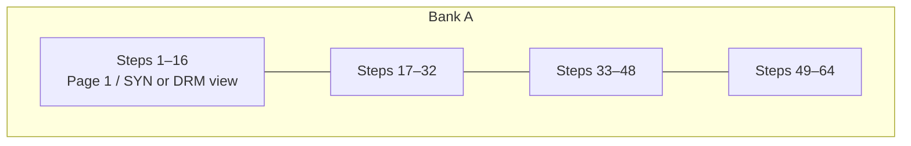
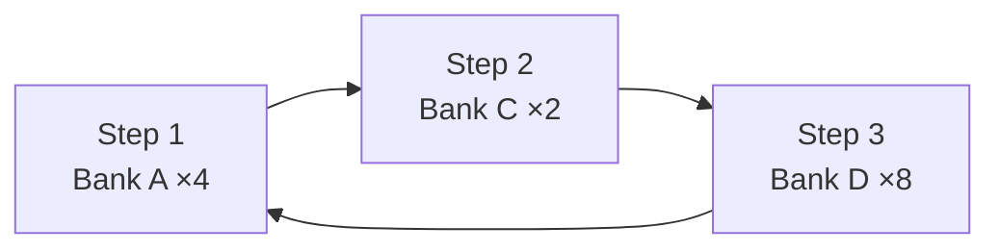

# Octopus PRO XL v6.1 — User Manual

**Laser Harp Groovebox · Firmware 6.1.01**

| Field | Value |
|-------|-------|
| Document type | End-user & integrator reference |
| Firmware | `6.1.01` · NVS namespace `octopus` · `SETTINGS_VERSION 0x0616` (struct layout) |
| Companion app | [octopus.isystem.app](https://octopus.isystem.app) (Web MIDI / SysEx · **v6.2.07** — Octopus linked + MIDI Controller mode) |
| Hardware UI | SH1106 OLED · rotary encoder · SCALE · OC |

This manual describes the Octopus PRO XL from initial setup through complete operation of the hardware menu system, companion application, signal routing, and musical tools (sequencer topology, arpeggiator layouts, D-BEAM response curves, and effects character). Menu labels and category order match the on-device OLED display exactly (`display.h`).

For repository overview and build instructions, see [**README.md**](https://github.com/iSystemDevelopment/Octopus_PRO_XL_v6.0/blob/main/README.md). Product site: [**octopus-info.isystem.app**](https://octopus-info.isystem.app). App: [**octopus.isystem.app**](https://octopus.isystem.app). Source: [**GitHub**](https://github.com/iSystemDevelopment/Octopus_PRO_XL_v6.0). [Facebook](https://www.facebook.com/diodac.co.uk/). For developer architecture, see [**code_info.h**](./code_info.h).

---

## Table of contents

1. [Product overview](#1-product-overview)
2. [System architecture](#2-system-architecture)
3. [Connections & initial configuration](#3-connections--initial-configuration)
4. [Control surface reference](#4-control-surface-reference)
5. [Operational dashboards](#5-operational-dashboards)
6. [Menu navigation model](#6-menu-navigation-model)
7. [Technical reference — layouts, curves & effects](#7-technical-reference--layouts-curves--effects)
8. [Main menu reference](#8-main-menu-reference)
9. [OctopusApp companion](#9-octopusapp-companion)
10. [Recommended workflows](#10-recommended-workflows)
11. [Diagnostics & troubleshooting](#11-diagnostics--troubleshooting)
12. [Appendices](#12-appendices)

---

## 1. Product overview

Octopus PRO XL is an embedded performance instrument that unifies **laser harp playing**, **step sequencing**, **drum synthesis**, **proximity expression**, and **programmable laser visuals** on a single ESP32-S3 platform. The design prioritises **standalone operability**: a performer can select scales, browse 128 factory presets, compose 64-step patterns across four banks, chain arrangements in song mode, and persist the entire session to flash — without external software.

When a host computer is available, **OctopusApp** provides a graphical editing environment over USB MIDI SysEx. Transport authority (play, stop, record arm, tempo) remains on the hardware control surface at all times, ensuring predictable live behaviour and eliminating parameter fights between UI layers.

### 1.1 Engine summary

| Engine | Function | Primary I/O |
|--------|----------|-------------|
| **Harp** | 8-string laser instrument, scales, play modes, optional arp | Beam break → note; RGB galvo output |
| **Sequencer** | Melody grid (rows 1–8) + drum grid (rows 9–16), 64 steps | Internal clock; USB SysEx to OctopusApp |
| **Drums** | 8-voice synthesis (kick … perc) | Grid row triggers; kit character presets |
| **D-BEAM** | Hand-proximity expression | ADC → internal synth modulation only |
| **FX bus** | Shared delay/reverb + per-engine inserts | I2S stereo master output |
| **Laser show** | Hue matrix, animation, drum flash | Galvo + RGB (independent of audio MIDI) |

---

## 2. System architecture

### 2.1 Dual-core topology

Processing is partitioned across ESP32-S3 cores to isolate **galvo timing** from **audio DSP**:



### 2.2 Audio signal path

Each engine passes through **insert FX-A** (modulation/time), **insert FX-B** (dynamics), then summed sends to the **global delay/reverb aux**, **master bus** (tube, DJ filter, EQ, master preset), and finally the I2S DAC.



### 2.3 Control-plane & persistence

All parameter writes funnel through **`patches.h`** apply-functions so hardware encoder turns, OLED menu edits, and OctopusApp SysEx commands converge on identical atomic state. Session data is stored in **NVS** with four scoped operations:

| Scope | Save | Load | Reset |
|-------|------|------|-------|
| **Full** | Entire device state → NVS + reboot | Reload all blobs (no reboot) | `pend_rst` flag + instant reboot → boot wipe |
| **Banks+Pats** | Pattern grids, user slots, bank deltas → NVS + reboot | Re-seed factory banks + overlay stored blobs | `pend_rst` flag + instant reboot → boot wipe |
| **Motion** | P-lock lanes → NVS + reboot | Clear matrix + overlay motion blob | NvsWorker erase, applied live — **no reboot** (fw ≥ 6.1.01) |
| **Settings** | Mix, MIDI, laser, D-BEAM, songs → NVS + reboot | Reload settings blob only | NvsWorker factory settings, applied live — **no reboot** (fw ≥ 6.1.01) |

**NVS keys:** `settings`, `patterns`, `banks`, `usrnames`, `usrpat`, `usrpatnames`, `motion`, plus control key `pend_rst` (u8) for deferred FULL/BANKS reset.

---

## 3. Connections & initial configuration

### 3.1 Requirements

- Octopus PRO XL (laser module + control enclosure)
- USB data cable (power + communication)
- Chromium-based browser (Chrome, Edge) for OctopusApp
- Optional: USB MIDI host for harp/seq/drum output routing

### 3.2 Power-on sequence

1. Connect USB. Firmware loads persisted settings from NVS and restores the last active dashboard (HARP or SEQUENCER).
2. The laser harp gate defaults to **closed** at boot; open explicitly with **OC long-press** on the HARP dashboard.
3. Open **[octopus.isystem.app](https://octopus.isystem.app)** — the App auto-connects when the Octopus USB MIDI port is detected (**Octopus ON** badge).

### 3.3 Factory reset at boot

To restore factory defaults:

1. Power off the device.
2. Press and hold **OC** and **SCALE** simultaneously.
3. Apply power while holding both buttons for approximately **150 ms** until the reset routine begins.
4. The unit arms a deferred reset, reboots, and on the next boot restores factory state before any audio or laser tasks start.

Runtime **Full Reset** and **Banks+Pats Reset** arm an NVS flag and reboot immediately (under ~200 ms). The actual wipe runs at the start of the next boot — the same safe window as the button combo above. **Settings Reset** and **Motion Clear** apply live on the running device via a short NvsWorker commit and, from firmware **6.1.01**, do **not** reboot — OctopusApp simply reloads and re-pulls the fresh settings/motion image from the device.

Scoped resets are also available under **RESET** in the main menu ([§8.14](#814-reset)).

### 3.4 App-connected mode

When OctopusApp maintains an active Web MIDI connection, the OLED displays **APP CONNECTED**. Hardware input is restricted to:

| Control | Assigned function |
|---------|-------------------|
| **SCALE** (short) | Play / Stop |
| **OC** (short) | Record arm toggle |
| **Encoder turn** | BPM adjustment (40–240) |
| **Encoder long-press** | No action (SAVE/LOAD use the App) |

Parameter editing is performed exclusively in the App during this mode, preventing concurrent modification of the same atomic parameters from two surfaces.

---

## 4. Control surface reference

The instrument exposes three physical controls. Gestures are **context-sensitive** according to dashboard (HARP vs SEQUENCER) and menu depth.

### 4.1 Gesture map



### 4.2 Rotary encoder (ENC)

| Gesture | Duration / pattern | Typical function |
|---------|-------------------|------------------|
| Turn | Linear 1:1 detents | Adjust value, scroll menu, browse presets |
| Click | Short press | Enter / confirm / descend menu level |
| Double-click | ~230 ms window | Navigate upward (L3→L2→L1→dashboard) |
| Long-press | ~600 ms | Open scoped **SAVE** menu |

### 4.3 SCALE button

| Gesture | HARP dashboard | SEQUENCER dashboard |
|---------|----------------|---------------------|
| Short | All-notes-off + advance scale | Toggle play / stop |
| Long (~550 ms) | Switch to SEQUENCER dashboard | Switch to HARP dashboard |
| Hold + encoder turn | Harp octave shift (±4 semitones) | — |

### 4.4 OC button (Open / Close)

| Gesture | HARP dashboard | SEQUENCER dashboard |
|---------|----------------|---------------------|
| Short | Cycle play mode: POLY8 → STRINGS → SOLO | Toggle record arm |
| Long (~800 ms) | Toggle laser harp gate (open ↔ close) | — |

### 4.5 Confirmation modals

Destructive operations present a **YES / NO** dialog. The default selection is **NO** to guard against accidental data loss.

- **Encoder turn** — move selection (left = NO, right = YES)
- **Encoder click** — execute selection
- **Encoder double-click** — cancel (equivalent to NO)

---

## 5. Operational dashboards

Long-press **SCALE** toggles between dashboards. Each dashboard provides at-a-glance status and direct encoder shortcuts before entering nested menus.

### 5.1 HARP dashboard

Displays active **scale**, **play mode**, **preset name**, **BPM**, and harp gate state (open / closed / animating).

| Objective | Procedure |
|-----------|-----------|
| Browse factory presets (128 named) | Turn encoder on dashboard |
| Select scale | Short **SCALE** |
| Shift harp octave | **SCALE** held + encoder turn |
| Change play mode | Short **OC** |
| Open / close laser gate | Long **OC** |
| Enter menu at HARP SETUP | Short encoder click |

#### Play mode characteristics

| Mode | Voice allocation | Timbre | Harp arp |
|------|------------------|--------|----------|
| **POLY8** | Up to 8 simultaneous notes (one voice per string) | Standard dual-osc synth | Enabled; latches held notes (poly stack) |
| **STRINGS** | Same polyphony with string-resonance model | Vibrato + staccato release profile | **Disabled automatically** |
| **SOLO** | Single note (king-of-stack priority) | Standard synth on solo voice | Enabled; follows solo voice latch |

```text
POLY8 holding C4 + E4 + G4:     C4 ─┐
                                   E4 ─┼─ all sound together
                                   G4 ─┘

SOLO same input:                  only the most recent note sounds

STRINGS:                          wobble + physical decay model (no arp)
```

### 5.2 SEQUENCER dashboard

Displays active **bank** (A–D), **BPM**, **pattern length**, transport state, and a page-aware step progress indicator.

| Objective | Procedure |
|-----------|-----------|
| Set tempo | Turn encoder |
| Play / stop | Short **SCALE** |
| Arm / disarm record | Short **OC** |
| Enter menu at SEQ SETUP | Short encoder click |

#### Parameter motion recording (P-locks)

1. Short **OC** to arm recording.
2. Short **SCALE** to begin playback.
3. Modify automatable parameters during playback (via menu or pre-connected App).
4. Short **OC** again to disarm.

Each pattern stores up to **four motion lanes** — per-step automation of parameters such as filter cutoff, send levels, or mixer values. Lanes replay during subsequent passes through the pattern.

---

## 6. Menu navigation model

### 6.1 Hierarchy

| Level | OLED content | Encoder turn | Encoder click |
|-------|--------------|--------------|---------------|
| **IDLE** | Dashboard | BPM or preset browse | Enter MENU L1 |
| **MENU L1** | 15 categories (performance order) | Scroll category | Enter MENU L2 |
| **MENU L2** | Items within category | Scroll item | Enter L3 or special editor |
| **MENU L3** | Live parameter value | Adjust value | Return to L2 |

Double-click the encoder at any level to step back toward the dashboard without saving.

### 6.2 Main menu order (on-device)

Categories appear in this sequence on the OLED:

```text
 1. HARP SETUP       9. MASTER
 2. HARP SYNTH       10. D-BEAM
 3. SEQ SETUP        11. MIDI I/O
 4. SEQ MATRIX       12. LASER SHOW
 5. SEQ SYNTH        13. TELEMETRY
 6. SONG             14. RESET
 7. DRUM KIT         15. SAVE
 8. AUX FX           16. LOAD
```

### 6.3 Full-screen editors

Certain L2 selections bypass the standard L3 value screen:

| Menu path | Editor function |
|-----------|-----------------|
| HARP SETUP → Edge Comp | Per-string trigger height (8 bars × 16 scales) |
| SEQ MATRIX → Open Grid | 16×8 step matrix with bank navigation |
| SONG (L2 enter) | Chain row editor (bank + repeats) |
| TELEMETRY (L2 enter) | Live diagnostic scope (7 views — see [§8.13](#813-telemetry)) |

---

## 7. Technical reference — layouts, curves & effects

This section documents the **musical and signal-processing semantics** underlying menu parameters — independent of whether you edit from hardware or OctopusApp.

### 7.1 Sequencer grid topology

The sequencer stores patterns as **64 steps × 16 rows** per bank. Hardware and App present a **16×8 window** at a time; position within the full 64 steps is selected by **step page** (App: **P1–P4**; hardware SEQ MATRIX: encoder L/R at column 1 or 16).

#### Row assignment

```text
 Row (UI)   Engine row   Content
 ─────────────────────────────────────────
  1 –  8    0 –  7       Melody (scale degrees 1–8)
  9 – 16    8 – 15       Drums (Kick … Perc)

 Drum row map:
   9 → Kick    10 → Snare   11 → Clap    12 → HH Closed
  13 → HH Open 14 → Tom-H   15 → Tom-L   16 → Perc
```

#### Bank & page model



| Concept | Range | Notes |
|---------|-------|-------|
| Banks | A–D (0–3) | Independent pattern + sound snapshot per bank |
| Pattern length | 16 / 32 / 48 / 64 | Steps beyond length are masked (shown crossed on OLED) |
| View S/D | Synth page / Drum page | Hardware matrix shows rows 1–8 or 9–16 |
| Chain index | Fixed 0 | v6.0 UI pins chain 0; song mode handles multi-bank playback |

#### Matrix editor navigation (hardware)

```text
         col 1    col 2   …   col 16
 row 1   [ ]      [■]         [ ]     ← OC/SCALE move vertically
 row 2   [ ]      [ ]         [■]     ← encoder moves horizontally
  …
 row 8   [■]      [ ]         [ ]

 • Horizontal wrap at column 16 → previous/next **step page** (P1–P4, count bounded by LEN); on the last page, wrap to the next bank at page 1
 • Horizontal wrap at column 1 → previous step page; on page 1, wrap to the previous bank's last page
 • Vertical wrap at row 1/8 → switch SYN/DRM view or adjacent bank
 • Encoder click → toggle step at cursor (absolute step 1–64)
 • Status bar (inverted top line) — e.g. `A SYN P2/4 R1 S20/64`: bank, synth/drum view, step page, cursor row, absolute step / pattern length
```

### 7.2 Arpeggiator pattern reference

Both harp and sequencer arpeggiators share the **`arp::Engine`** core (`arp.h`). Notes are latched on input, sorted ascending for directional patterns, and retriggered at BPM-scaled periods.

#### Rate divisions

**Sequencer arp** — 8 rates (MIDI tick basis at 480 ticks/quarter):

| Index | Label | Ticks | At 120 BPM ≈ |
|-------|-------|-------|--------------|
| 0 | 1/1 | 1920 | 2.0 s |
| 1 | 1/2 | 960 | 1.0 s |
| 2 | 1/4 | 480 | 0.5 s |
| 3 | 1/8 | 240 | 0.25 s |
| 4 | 1/8T | 160 | triplet eighth |
| 5 | 1/16 | 120 | 0.125 s |
| 6 | 1/16T | 80 | triplet sixteenth |
| 7 | 1/32 | 60 | 0.0625 s |

**Harp arp** exposes indices 3–6 only (1/8, 1/8T, 1/16, 1/16T) — musically suited to live harp performance.

#### Gate length

Eight gate steps define note duty cycle as a percentage of each arp period:

```text
Gate index:  0    1    2    3    4    5    6    7
Duty %:     100   75   50   38   25   19   13    6

Visual (one period):  ████████░░░░  ≈ 50% gate
```

#### Pattern layouts (sequencer — 8 patterns)

Given latched notes **C4, E4, G4** (low → high):

| Pattern | Playback order | Diagram |
|---------|----------------|---------|
| **Up** | C → E → G → C … | `C E G C E G` |
| **Down** | G → E → C → G … | `G E C G E C` |
| **UpDn** | C → E → G → E → C … | `C E G E C` (ping-pong, no repeat top) |
| **DnUp** | G → E → C → E → G … | reverse ping-pong |
| **Rnd** | Pseudorandom index | `G C G E …` |
| **AsIs** | Order of input latch | preserves performance order |
| **Up+1** | Up pattern + octave | each step +12 semitones |
| **Dn-1** | Down pattern − octave | each step −12 semitones |

```text
UpDown cycle for 3 notes (indices 0,1,2,1):

  pitch
    G ─────●
    E ───●   ●───
    C ─●           ●─
       1  2  3  4  5  step
```

**Harp arp** maps UI indices 0–3 to **Up, Down, UpDn, Rnd** only. In **POLY8**, the engine latches all held strings; in **SOLO**, the king note defines the motif. Single-beam input expands to a **scale motif** so patterns remain musically distinct.

> **v6.0.01:** Harp arp maps **Up, Down, UpDn, Rnd** (see table above). The arpeggiator engine fixes (pitch-row laser sync, DnUp ping-pong, AsIs latch order) and the harp-arp ↔ App sync fix are in this release — see [CHANGELOG.md](./CHANGELOG.md#601--2026-06-22).

### 7.3 D-BEAM response curves

D-BEAM converts hand proximity (ADC, Kalman-filtered) into a normalised **0…1 expression** value. A **user-selectable curve** shapes sensitivity before routing to the target synth.

#### Curve equations (normalised input *x*)

| Curve | Transfer | Character | ASCII shape |
|-------|----------|-----------|-------------|
| **Linear** | *y = x* | Neutral, proportional | `/` |
| **Inverted** | *y = 1 − x* | Near = quiet, far = loud | `\` |
| **Exponential** | *y = x²* | Slow start, strong at close range | `_/` |
| **Logarithmic** | *y = √x* | Fast initial response, soft top | `/‾` |
| **Sigmoid** | *y = x²(3−2x)* | Soft knee near extremes (smoothstep) | `S` |

```text
Output
1.0 ┤           Linear ----
    │         _--    Sigmoid ···
    │       _-     Exp - - -
    │     _-    Log ·····
    │   _-
0.0 ┼────────────────────── Input (far → near)
    0.0                  1.0
```

#### Routing modes

| Route | Destination | Typical use |
|-------|-------------|-------------|
| **Off** | — | Bypass (Enable also required) |
| **Modulation** | LFO depth / timbral mod | Gestural swells |
| **Volume** | Amplitude (linear forced pre-curve) | Expressive dynamics |
| **Cutoff** | Filter cutoff | Brightness sweep |

**Target** selects **Harp Synth** or **Melody Synth** (sequencer). D-BEAM operates entirely in the **local DSP path** — no MIDI CC is transmitted.

**Calibration procedure:** Set **Offset** with hand clear of sensor; set **Range** at maximum intended playing distance; select curve and route; adjust **Env Atk / Rel** for smoothing.

### 7.4 Effects architecture & character guide

Each engine (harp, seq, drums) has **FX-A** (modulation/time) and **FX-B** (dynamics). All engines share **one global delay/reverb return bus** (the shared room). Per-engine **send levels** route into that bus; **room character** (time, feedback, size, damping) is edited globally or recalled via **Room Scn** presets in the AUX FX menu.

**Insert-A recall (default):** loads the insert effect (mode, params, mix) and **send amounts only** — it does **not** change the shared room unless **Link Aux** is ON.

**Room Scn (AUX FX menu):** recalls one of 16 authored `AUX_SCENES[]` rows into the shared bus in a single pack write (`loadAuxScene()`).

**Link Aux (default OFF):** when ON, recalling any FX-A insert preset also applies that preset’s authored delay/reverb character fields to the shared room (legacy “full scene” behaviour).

#### Insert FX-A (UI names → DSP mode)

Names are the abbreviated form of `INSERT_FX_PRESETS[]` in `effect.cpp` (1:1 with `kInsertFxNames[]` on the OLED and `INSERT_FX_NAMES` in OctopusApp); the index is the wire value, so the DSP mode below is fixed per row.

| # | Name | Engine type | Character |
|---|------|-------------|-----------|
| 0 | Nebula Taps | Bypass + wet sends | Delay/reverb wash; neutral insert |
| 1 | Snova Chorus | Chorus | Wide stereo swell, moderate depth |
| 2 | Pulsar Mod | Ring mod | Metallic sideband bell tones |
| 3 | Quasar Phase | Phaser | Notched sweep + reverb tail |
| 4 | Chronos Echo | Bypass + delay | Tempo-agnostic echo emphasis |
| 5 | Singul Tube | Distortion | Aggressive tube-style saturation |
| 6 | Jet Flange | Flanger | Jet comb filtering |
| 7 | Astral Shmr | Chorus | Shimmer verb blend |
| 8 | Dark SubRoom | Bypass + verb | Large dark reverb room |
| 9 | Cosmos Tape | Bypass + delay | Tape-style echo |
| 10 | Hyper ResMod | Ring mod | Higher carrier shimmer |
| 11 | Vortex Swirl | Phaser | Comb swirl, moderate mix |
| 12 | **Organic Drive** | Distortion | **Organic drum/melody drive** — warm even harmonics, strong on transients |
| 13 | Aether Gate | Bypass + verb | Bright shimmer gate |
| 14 | Void Satur | Distortion | Heavy saturation + room |
| 15 | Zero Quantum | Ring mod | Extreme carrier/detune |

**Organic Drive** (index 12): optimised for **musical saturation** on drums and melodic sources (drive ~2.6, tone ~0.68, mix ~0.44 in the preset table).

#### Insert FX-B — dynamics

| # | Name | Type | Application |
|---|------|------|-------------|
| 0 | Dyn Byp | Off | Transparent |
| 1 | Glue Comp | Compressor 4:1 | Gentle bus glue |
| 2 | Punch Comp | Compressor 6:1 | Transient emphasis |
| 3 | Soft Lim | Limiter | Smooth peak control |
| 4 | Brick Lim | Limiter | Hard ceiling |
| 5 | Noise Gate | Gate | Suppress bleed |
| 6 | Tight Gate | Gate | Higher threshold gate |
| 7 | Trans Pun | Transient shaper | Attack enhancement |
| 8 | Snap Atk | Transient | Fast snap |
| 9 | Drum Smk | Transient | Drum-focused punch |
| 10 | Bus Glue | Compressor | Mix bus |
| 11 | Vocal Ride | Compressor | Slow release leveling |
| 12 | Harp Sus | Compressor | Sustained harp smoothing |
| 13 | Seq Pump | Compressor 8:1 | Rhythmic ducking / pump |
| 14 | Sub Gate | Gate | Sub-only isolation |
| 15 | Max Safe | Limiter | Safety ceiling |

#### Master FX presets (selection)

| Preset | Role |
|--------|------|
| Aether Bypass | Clean pass-through |
| Galactic Bus | Gentle EQ lift |
| Magnetar Sat / Pulsar Impact | Increasing saturation + EQ |
| LPF Deep Sweep / HPF Prism Sweep | DJ-style filter motion |
| Nova OD / Quantum Tube | Master overdrive tones |
| Centauri Master | Polished final bus |

Master **tube** (TB Drive/Tone/Mix), **DJ filter**, and **EQ** are also available as continuous parameters under **MASTER**.

### 7.5 Song mode playback model

Song mode replaces single-bank loop behaviour with an ordered **chain** of bank references.



| Field | Range | Meaning |
|-------|-------|---------|
| Bank | A–D | Pattern bank to play |
| Repeats | 1–15 | Loop count before advancing |
| Song slots | 0–15 | Independent chain storage |
| Max rows | 16 per slot | Append rows in hardware song editor |

Enable song mode and select slot from **OctopusApp** (SEQUENCER toolbar) or persist via saved settings. Hardware **SONG** menu edits row content.

### 7.6 Scale system

Sixteen scales map eight strings to pitch classes. Standard scales share uniform RGB; **Rainbow Major / Minor** assign **per-string colours** and independent edge-compensation tables.

| # | Name | Type |
|---|------|------|
| 01 | Major | Diatonic |
| 02 | Minor | Diatonic |
| 03 | Pentatonic | 5-note |
| 04 | Blues | Blues scale |
| 05–08 | Dorian … Mixolydian | Modes |
| 09 | Locrian | Mode |
| 10–11 | Harmonic / Melodic Minor | Minor variants |
| 12–13 | Spanish / Arabic | Colour scales |
| 14 | Chromatic | Semitone |
| 15–16 | Rainbow Maj / Min | Per-string hue + edge tables |

---

## 8. Main menu reference

Complete operational index for hardware menus. Enter via **encoder click** from dashboard; category order matches OLED.

---

### 8.1 HARP SETUP

Per-scale beam triggering, colour, and idle behaviour (13 items).

| Item | Function | Adjustment notes |
|------|----------|------------------|
| Gate Hold | Note-on debounce (ms) | Increase in noisy environments |
| White Lvl | White-point laser intensity | Per-scale visibility tuning |
| Touch On / Touch Off | Beam confirm thresholds | Balance sensitivity vs false triggers |
| Beam Red / Green / Blue | Scale colour mix | RGB 0–255 per scale |
| Margin | Global trigger margin (DAC) | Primary sensitivity control |
| Stuck Rel | Auto-release timeout (ms) | Safety for blocked beams |
| Edge Comp | Per-string fine trigger (%) | Opens full-screen 8-bar editor |
| Fog Reject | Haze/fog false-trigger filter | Enable in foggy venues |
| Fog Margin | Differential reject threshold | Tune with Fog Reject on |
| Screensvr | Idle animation when harp closed | Independent of LASER SHOW |

**Edge Comp editor:** SCALE = next string; OC = next scale (live); encoder = value; encoder click = factory reset for string; encoder long = save & exit.

---

### 8.2 HARP SYNTH

25-parameter harp synthesizer including arpeggiator.

| Items | Parameters |
|-------|------------|
| 0–13 | Waveform, ADSR, filter, noise, detune, LFO (rate/depth/route), osc2, env→cutoff |
| 14–15 | FX-A / FX-B slot selection |
| 16–17 | Delay / reverb send |
| 18 | Snd Preset — 128-name factory bank |
| 19–20 | Save Slot / Load Slot (64 user slots) |
| 21–24 | H Arp On, Pat, Rate, Gate |

**LFO routes:** Pitch · Filter · Wave · Ptch+Flt · Flt+Wave · Ptch+Wav · All 3 · Tremolo

---

### 8.3 SEQ SETUP

Pattern management and sequencer arp (**13 items**).

| Item | Function |
|------|----------|
| Bank A-D | Active bank select |
| View S/D | Synth vs drum matrix page |
| Transpose | ±12 semitones |
| Length | 16 / 32 / 48 / 64 steps |
| Load Synth / Load Drum | Factory pattern recall |
| Clear | Wipe active bank (confirm) |
| Save Pat / Load Pat | 64 user pattern slots |
| Arp On / Type / Rate / Gate | Sequencer arpeggiator ([§7.2](#72-arpeggiator-pattern-reference)) |

---

### 8.4 SEQ MATRIX

| Item | Function |
|------|----------|
| Open Grid | Enter 16×8 step editor ([§7.1](#71-sequencer-grid-topology)) |

**On-device paging:** pattern **Length** (16 / 32 / 48 / 64 in SEQ SETUP) sets how many step pages exist (1–4). The matrix always shows 16 columns; move the encoder past column 16 (or before column 1) to change step page. Steps beyond **Length** appear crossed out. The playhead underline appears only when the running step is on the visible page.

---

### 8.5 SEQ SYNTH

Melody engine parameters — **21 items** (synth core + preset/slots; no harp arp entries). Parameter set mirrors HARP SYNTH items 0–20.

---

### 8.6 SONG

| Item | Function |
|------|----------|
| *(L2 enter)* | Row editor: BANK + REPEATS per step ([§7.5](#75-song-mode-playback-model)) |

**Controls:** encoder turn = edit value; SCALE / click = move cursor; OC = append row; OC+SCALE = delete row.

---

### 8.7 DRUM KIT

40 voice parameters + kit + pitch.

**Voices:** Kick, Snare, Clap, HH-C, HH-O, Tom-H, Tom-L, Perc — each with Tune, Decay, Vol, Noise, Wave (Clap/HH: no body wave — Tune/Noise shape the noise engine).

| Item | Function |
|------|----------|
| Drum Kit | TR-909 · TR-808 · Trap · House — reloads per-voice tuning + snare/clap/hat synthesis character (body+rattle snare, bandpass clap, 6-osc metal hats) |
| Drm Pitch | Global drum tuning. Kick/toms/perc follow directly; snare body + hats normalize to factory ×0.60 at default |

---

### 8.8 AUX FX

Shared **room** (one delay + one reverb return for the whole mix) and per-engine routing (16 items):

| Item | Function |
|------|----------|
| Room Time | Shared delay time (0–1.5 s) — `CMD_H_FX_TIME` / `CMD_S_FX_TIME` alias the same bus |
| Room FB | Shared delay feedback |
| Room Size | Shared reverb size |
| Room Dmp | Shared reverb damping |
| H/S Dly·Rev Snd | Per-engine send levels into the shared bus |
| Harp/Seq/Drum FX-A/B | Insert preset selectors (FX-A = modulation, FX-B = dynamics) |
| **Room Scn** | Recall shared-room preset 0–15 (`AUX_SCENES[]`, wire `CMD_AUX_SCENE_IDX` 194) |
| **Link Aux** | OFF (default): FX-A recall changes sends only. ON: FX-A recall also copies preset aux fields to the shared room (`CMD_LINK_AUX_PRESET` 195) |

Preset recall uses **pack load** (one struct copy under `patchMux`; DSP reads a per-buffer snapshot). The shared aux engine is a **single** `SharedAux` instance — no per-engine duplicate delay/reverb chains (stable CPU/RAM budget).

---

### 8.9 MASTER

24 items: M.Vol, H/S/D Vol, M.Pitch, FX Preset, Drum Rev/Dly, Tube, DJ filter, EQ, Drum FX slots, mutes (L2 click toggle), H/S/D Pan.

---

### 8.10 D-BEAM

Offset, Range, Curve, Enable, Env Atk/Rel, Route, Target — see [§7.3](#73-d-beam-response-curves).

---

### 8.11 MIDI I/O

PB Range, PB Enable (L2 toggle), Harp Ch, Seq Ch, Drum Ch — USB MIDI channel routing.

---

### 8.12 LASER SHOW

Show Mode, MIDI Hue, Base Hue, Anim Mode (Pulse/Chase/Strobe/Wave), Drum Flash, Hue ADSR.

---

### 8.13 TELEMETRY

Seven diagnostic views. From **MENU L1 → TELEMETRY**, scroll **MENU L2** with the encoder, then **encoder click** opens the selected view. While a view is active:

| Control | Function |
|---------|----------|
| Encoder turn | Cycle views 1–7 (wraps) |
| Encoder click | Exit to dashboard |
| Encoder double-click | Exit to dashboard |

| L2 item | On-screen content |
|---------|-------------------|
| **AC Scope** | AC-coupled beam amplitude trace (true RMS above noise floor) |
| **DC Bias** | Average DC servo bias (volts + raw ADC counts, mid-rail ≈ 1.65 V) |
| **DAC Thresh** | Eight per-string AGC threshold bars (12-bit DAC scale 0–4095) |
| **D-BEAM Expr** | Post-curve expression magnitude (0–16383) |
| **SNR** | Signal-to-noise ratio trace (`maMv / noise floor`) |
| **System** | CPU load %, DRAM/PSRAM free, D-BEAM carrier freq, stack low warning |
| **Fog Reject** | Eight amplitude bars with floor + accept lines (margin tuning aid) |

The OLED refreshes continuously (~30 Hz) while any telemetry view is open. **System** stats update every 5 s. Scope traces (AC, D-BEAM, SNR) auto-range to recent peaks.

---

### 8.14 RESET

Four scopes mirror SAVE/LOAD. L2 click → confirm → execute.

| Scope | Runtime behaviour |
|-------|-------------------|
| **Full Reset** | Arms NVS `pend_rst` → immediate reboot → boot kernel wipes all blobs + factory settings |
| **Banks+Pats** | Same deferred path — clears patterns, banks, user slots; keeps settings & motion |
| **Motion Clr** | Clears P-lock matrix in RAM + NVS via NvsWorker — applied live, **no reboot** (fw ≥ 6.1.01) |
| **Settings** | Factory knob/mixer/laser defaults in RAM + NVS via NvsWorker — applied live, **no reboot** (fw ≥ 6.1.01) |

After a **Full** / **Banks+Pats** reset the device reboots and the OLED returns to the normal dashboard; **Motion** / **Settings** reset stay running (no reboot). Either way, OctopusApp reloads and re-imports via `APP_SYNC_REQ`.

---

### 8.15 SAVE / 8.16 LOAD

Same four scopes. **SAVE** writes current RAM to NVS via NvsWorker (+ reboot). **LOAD** reloads from NVS into RAM without reboot (App receives full state echo).

---

## 9. OctopusApp companion

Open **[octopus.isystem.app](https://octopus.isystem.app)** in Chrome or Edge over **HTTPS**. The App auto-connects over USB MIDI SysEx (`0x7D` host→device, `0x7C` device→host). After SAVE, LOAD, or RESET the page reloads and re-imports the full device state.

### 9.1 View structure

| Tab | Content |
|-----|---------|
| **INSTRUMENTS** | Laser show, D-BEAM, harp synth, seq synth |
| **MIXER** | Levels, pans, mutes, master processing, insert wet controls; **drum beat-reactive scope** (fits panel, no scroll) |
| **SEQUENCER** | 64-step grid (P1–P4), banks, song editor, pattern loaders, arp |

### 9.2 Transport & authority

Header **PLAY / STOP / REC** and **BPM** field are **read-only reflectors**. Hardware **SCALE**, **OC**, and encoder own transport. The App supervisor re-asserts device state to prevent UI drift.

### 9.3 Utility bar

SAVE · LOAD · RESET · SLOTS · CPY/PST · RND-H/RND-D · CLR · mutes · DBEAM · MIDI routing · MON · HELP

App version is shown in the **browser tab title**, the startup log line, and **HELP** — not in the header bar (keeps the compact transport/tool row visible on smaller screens).

### 9.3.1 Pattern pages (P1–P4) & grid tools

Each **bank A–D** holds up to **64 steps**. The App shows **16 steps at a time** on the SEQUENCER grid:

| Control | Scope |
|---------|--------|
| **A–D** | Four independent patterns (banks) |
| **P1–P4** | 16-step windows within the active bank (steps 1–16 … 49–64) |
| **LEN** | Pattern length 16 / 32 / 48 / 64 — steps beyond LEN are dimmed but pages stay clickable |

**Grid tools** (header + pattern dropdowns) operate on the **active P page only** — the 16 columns currently shown — not the whole bank:

| Tool | Behaviour |
|------|-----------|
| **CPY / PST** | Copy / paste the active P page (16×16 cells) within or across pages |
| **CLR** | Clear active P page only — other pages, bank data, and sounds unchanged |
| **RND-H / RND-D** | Randomize melody (rows 1–8) or drum (rows 9–16) on the active P page |
| **MELODY / DRUM PATTERNS** | Factory ROM loads into the active P page (16 steps) |

Click **P1–P4** to lock the grid view (**user lock**): while playing, the cyan playhead still tracks hardware (Octopus) or the local clock (MIDI), but the grid won't auto-switch pages until you pick another P page.

**Playhead:** rendered on a dedicated GPU layer (`#seq-playhead-layer`) — smooth during mouse hover, grid repaints, and page changes. See [docs/app_god_rules.md](./docs/app_god_rules.md) for the full audit checklist.

**Octopus linked — CLR note:** App **CLR** is page-local. Hardware **SEQ SETUP → Clear** (full wipe + sound reset) is separate and is **not** triggered by the header CLR button.

### 9.4 Universal MIDI Controller mode *(OctopusApp v6.2.07 — shipped)*

When **no Octopus PRO XL** is connected (★ port absent from the MIDI list), OctopusApp operates as a **universal MIDI controller** in the browser — **no firmware update** required for MIDI mode itself. Open **[octopus.isystem.app](https://octopus.isystem.app)** in **Google Chrome** (or Microsoft Edge) over **HTTPS**.

| | Octopus linked | MIDI Controller |
|--|----------------|-----------------|
| **Trigger** | ★ Octopus USB port + SysEx echo | Non-★ MIDI output when **no** ★ port is connected |
| **Badge** | Octopus ON | MIDI OUT |
| **Tabs** | INSTRUMENTS · MIXER · SEQUENCER | INSTRUMENTS · SEQUENCER only |
| **Outbound** | Octopus SysEx (196 commands) | MIDI note on/off, CC, Program Change |
| **Transport** | Hardware SCALE / OC / encoder | App play · stop · BPM |
| **Persistence** | Device NVS (SAVE/LOAD) | Browser `localStorage` + EXP/IMP JSON |

**Octopus hard priority (v6.2.07):** while a ★ Octopus port is connected, the App **locks to Octopus mode**. You cannot pick a non-★ port from the dropdown — unplug Octopus to drive third-party MIDI gear. If Octopus and another interface are both plugged in, ★ always wins auto-connect.

**INSTRUMENTS (MIDI mode)** — seq synth panel (channel, program change, 8 CC knobs in a compact 4×2 grid, **SEQ ACT** scope canvas) and drum machine panel (per-row GM notes, **DRUM ACT** scope). Layout fits the panel with no scrollbars. No laser, D-BEAM, or studio mixer.

**SEQUENCER (MIDI mode)** — same 64-step grid (banks A–D, pages P1–P4). The App runs its own BPM clock, playhead, and fires MIDI notes each step (melody rows 1–8 scale-aware; drum rows 9–16 GM-style). **ARP** in the utility bar expands melody rows per step (pattern / rate / gate). **REC** can capture CC automation per step (purple dots on the grid). **Song mode** (🔗 chain toggle) plays up to 16 chain steps per slot (bank + repeats), matching hardware behaviour. **MELODY PATTERNS** and **DRUM PATTERNS** load factory patterns into the **active P page** (16 steps); notes go out on Play. **CPY/PST/CLR/RND** also scope to the active P page — see [§9.3.1](#931-pattern-pages-p1p4--grid-tools).

Octopus-only actions (SAVE, LOAD, RESET, SLOTS, CPU telemetry) are hidden in MIDI mode.

#### 9.4.1 What you need

| Item | Notes |
|------|-------|
| **Browser** | Google Chrome or Microsoft Edge (Web MIDI is not available in Safari or Firefox) |
| **HTTPS** | Use [octopus.isystem.app](https://octopus.isystem.app) or `localhost` — not a plain `file://` link |
| **MIDI destination** | USB MIDI interface, hardware synth, or a **virtual MIDI cable** into your DAW (see below) |
| **Octopus hardware** | **Not required** for MIDI Controller mode |

#### 9.4.2 Quick start (any platform)

1. **Unplug Octopus** (or ensure no ★ port appears in the list) if you want MIDI Controller mode — see **Octopus hard priority** above.
2. Open **Chrome** → [octopus.isystem.app](https://octopus.isystem.app).
3. When Chrome asks **“Allow MIDI devices?”** → click **Allow** (required once per site).
4. In the header **MIDI** dropdown, pick your output port (anything **without** ★). If ★ is present, the App stays on Octopus — unplug hardware first.
5. Confirm the badge shows **MIDI OUT** (cyan).
6. **INSTRUMENTS** tab → set melody channel (default Ch 1), drum channel (default Ch 10), Program Change if needed, CC knobs.
7. **SEQUENCER** tab → click cells to enter notes (rows 1–8 melody, 9–16 drums). Use banks **A–D** and pages **P1–P4** for up to 64 steps.
8. Optional: **🔗** song mode → **PAT/EDIT** chain editor → program bank order + repeats. **MELODY PATTERNS** / **DRUM PATTERNS** load factory grooves into the active bank.
9. Set **BPM** in the header (editable in MIDI mode), press **▶ Play**. External gear receives notes; optional **CLK** sends MIDI clock (24 PPQN).
10. Press **■ Stop** — all notes off. Patterns auto-save in the browser; use **EXP** / **IMP** in the routing bar to back up JSON (includes song chains).

#### 9.4.3 macOS + Google Chrome

**A — App only (no DAW)**

1. Connect a USB MIDI interface or class-compliant synth via USB.
2. Open **Chrome** → [octopus.isystem.app](https://octopus.isystem.app) → **Allow** MIDI.
3. Select the device in the App **MIDI** dropdown (e.g. `USB MIDI Interface`, `Minilogue`, `Digitakt`).
4. On the synth: set **MIDI channel** to match the App (melody Ch 1, drums Ch 10 by default).
5. Program the grid and press **Play**.

**B — Route OctopusApp into a DAW (Logic, Ableton, Reaper, etc.)**

Chrome cannot talk to a DAW directly; you need a **virtual MIDI bus** on the Mac:

1. Open **Audio MIDI Setup** (Applications → Utilities, or Spotlight).
2. **Window → Show MIDI Studio** → double-click **IAC Driver** → tick **Device is online** (creates **IAC Bus 1**).
3. In **OctopusApp**: MIDI dropdown → select **IAC Driver Bus 1** (or your interface’s MIDI out).
4. In your **DAW**:
   - Create a **software instrument** track (or external MIDI track).
   - Set track **MIDI input** = **IAC Driver Bus 1** (same bus as step 3).
   - Arm the track for recording if you want to capture MIDI.
5. In OctopusApp: **INSTRUMENTS** → melody **Ch 1** (or match your plugin’s channel). **SEQUENCER** → program pattern → **Play**.
6. Optional: enable **CLK** in the App routing bar; in the DAW enable **MIDI clock sync** from that same input if you want the DAW to follow the App tempo.

**Tips (Mac)**

- If no ports appear: unplug/replug USB, refresh the page, check **System Settings → Privacy & Security** did not block Chrome.
- One **★ Octopus** tab is enough for hardware mode; for **MIDI OUT**, ensure ★ is **unplugged** (lockout while ★ is live).
- Use **EXP** before clearing browser data — `localStorage` holds your patterns.

#### 9.4.4 Windows + Google Chrome

**A — App only (hardware synth / interface)**

1. Install the driver for your USB MIDI interface if Windows does not see it (Device Manager → Sound, video and game controllers).
2. Open **Chrome** → [octopus.isystem.app](https://octopus.isystem.app) → **Allow** MIDI.
3. Select the port in the App dropdown (e.g. `loopMIDI Port`, `UM-ONE`, `Focusrite MIDI`).
4. Match channels on the receiving device; program grid → **Play**.

**B — Route OctopusApp into a DAW (Ableton, FL Studio, Cubase, Reaper, etc.)**

Windows has no built-in virtual MIDI cable. Install a free loopback driver:

1. Install **[loopMIDI](https://www.tobias-erichsen.de/software/loopmidi.html)** (or similar).
2. Run loopMIDI → **+** to add a port (e.g. `OctopusApp Out`).
3. In **Chrome / OctopusApp**: MIDI dropdown → select **OctopusApp Out**.
4. In your **DAW**:
   - Preferences → **MIDI** → enable **OctopusApp Out** as an **input** (track-arming may also need “All inputs” or that port enabled per track).
   - Add an instrument track; set **MIDI From** = **OctopusApp Out**, channel = melody channel (usually 1).
   - For drums: second track on drum channel (usually 10), or a multi-timbral plugin.
5. Program pattern in OctopusApp → **Play** → MIDI flows into the DAW plugin.

**Tips (Windows)**

- Run Chrome and the DAW as the same user; some drivers are not visible across sessions.
- If the port list is empty after install, restart Chrome and loopMIDI.
- Windows may show duplicate names — pick the **Output** side the App lists (Web MIDI outputs only).

#### 9.4.5 Using OctopusApp as a MIDI controller in your DAW

OctopusApp is a **browser tab**, not a VST/AU plugin. You do **not** “open” it inside the DAW — you **route MIDI from Chrome into the DAW**:

```text
┌─────────────────┐     USB / virtual MIDI      ┌──────────────────┐
│  Google Chrome  │  note · CC · PC · clock     │  DAW or hardware │
│  octopus.isystem│ ──────────────────────────► │  synth / drums   │
│  .app (MIDI OUT)│                             │                  │
└─────────────────┘                             └──────────────────┘
```

| Step | Action |
|------|--------|
| 1 | Virtual cable: **IAC Driver** (Mac) or **loopMIDI** (Windows) — or a physical MIDI interface |
| 2 | OctopusApp header → MIDI port = that cable’s **output** |
| 3 | DAW track → MIDI **input** = same cable |
| 4 | Match **channels** (App INSTRUMENTS / routing bar vs plugin MIDI channel) |
| 5 | Press **Play** in OctopusApp (transport is App-owned in MIDI mode) |
| 6 | Optional **CLK** → DAW external sync / drum machines that follow MIDI clock |

**Recording a performance:** arm a MIDI track in the DAW, press **Record** in the DAW, then **Play** in OctopusApp — note data is captured as standard MIDI.

**Multiple destinations:** Web MIDI sends to **one** selected port. To feed several devices, use a DAW mixer or a MIDI patch utility — not multiple OctopusApp tabs.

Further reference: [docs/midi_controller_mode.md](./docs/midi_controller_mode.md) · [octopus-info.isystem.app → MIDI Mode](https://octopus-info.isystem.app#midi-mode) · in-app **Help → MIDI CONTROLLER**.

#### 9.4.6 Support the project (optional)

If OctopusApp or the hardware helps your music, you can leave an optional tip via **[PayPal](https://www.paypal.com/donate?hosted_button_id=KX7B76V37PED8)** to **DIODAC ELECTRONICS** (`diodac.electronics@gmail.com`). The same link appears in OctopusApp (**TIP** / **DONATE** chips) and on the [product site contact section](https://octopus-info.isystem.app#contact). Donations are voluntary and do not unlock features.

---

### 9.5 OctopusApp version note

| Component | Version |
|-----------|---------|
| Firmware (hardware) | **6.1.01** |
| OctopusApp (browser) | **6.2.07** (Octopus linked + MIDI Controller mode) |

Octopus **linked** mode matches firmware **6.1.01** (including SETTINGS/MOTION reset with no reboot). MIDI Controller mode is browser-only and does not change flash on the device. While ★ Octopus is connected, the App locks to Octopus mode (v6.2.07 hard priority).

---

## 10. Recommended workflows

### 10.1 Live performance (hardware-centric)

1. HARP dashboard → select scale and preset → long **OC** to open gate.
2. Long **SCALE** → SEQUENCER → set BPM → short **SCALE** to start backing.
3. Long **SCALE** → return to harp for solo sections.

### 10.2 Pattern authoring (App + hardware)

1. Connect OctopusApp; edit grid on SEQUENCER tab (P1–P4 pages).
2. Disconnect or use hardware transport; arm record; capture P-locks during playback.
3. **SAVE → Full Save** before power cycle.

### 10.3 Sound library management

1. Sculpt patch in HARP SYNTH or SEQ SYNTH.
2. **Save Slot** → select index → confirm.
3. Name slot in App **SLOTS** modal for recall clarity.

### 10.4 MIDI Controller mode (no Octopus hardware)

1. **Unplug Octopus** (or confirm no ★ in the MIDI list) — MIDI mode is locked out while ★ is connected.
2. **Chrome** → [octopus.isystem.app](https://octopus.isystem.app) → allow MIDI.
3. **Mac:** enable **IAC Driver** in Audio MIDI Setup · **Windows:** install **loopMIDI** if routing into a DAW.
4. App MIDI dropdown → virtual bus or USB interface; badge **MIDI OUT**.
5. **INSTRUMENTS** → channels, PC, CC · **SEQUENCER** → pattern · optional **🔗** song chain · **MELODY/DRUM PATTERNS** · **▶ Play**.
6. DAW: instrument track MIDI input = same bus as App output; match MIDI channels.
7. **EXP** JSON backup before clearing browser data. Full guide: [§9.4](#94-universal-midi-controller-mode-octopusapp-v6207--shipped).

---

## 11. Diagnostics & troubleshooting

| Symptom | Recommended action |
|---------|-------------------|
| No harp audio | Verify gate open (OC long); check H.Vol, Harp Mute |
| Erratic triggering | Enable Fog Reject; adjust Margin / Edge Comp |
| App parameters inactive | Expected in APP CONNECTED mode for non-transport controls — use App UI |
| BPM uneditable in App | By design in Octopus mode — adjust on hardware encoder. In **MIDI OUT** mode BPM is editable in the header |
| No MIDI reaching DAW | Mac: enable IAC Driver · Windows: loopMIDI · App port = DAW MIDI input · match channels |
| Chrome shows no MIDI ports | Click Allow on MIDI prompt · refresh · replug USB · Windows: check interface driver |
| Wrong notes / silent synth | Match melody/drum **channels** in INSTRUMENTS · check plugin MIDI channel · press Stop (all notes off) |
| Lost MIDI pattern after refresh | Patterns live in browser `localStorage` — use **EXP** before clearing site data |
| Cannot pick non-★ MIDI port | **Expected** while Octopus is plugged in (v6.2.07 lockout) — unplug ★ to use MIDI Controller mode |
| Badge stuck Octopus OFF | No port selected, or waiting for sync — pick ★ for Octopus ON; with no ★, pick any output for MIDI OUT |
| OLED stuck **APP CONNECTED** after closing the App tab | Fixed v6.2.08 — App stops heartbeat on tab close; allow ~5 s if an old tab is still open |
| App stale after reconnect / Octopus switch | Fixed v6.2.08 — same-port resync sends `APP_SYNC_REQ`; Octopus↔MIDI still uses full page reload |
| Harp beams affect sequencer sound | Fixed fw — D-BEAM VOLUME route no longer resets the untouched engine's mix level on exit |
| Lost pattern after power | Perform SAVE → Full Save |
| Stuck notes | Short SCALE on HARP dashboard (panic) |
| Factory restore | Boot with OC+SCALE held, or RESET → Full Reset (instant reboot, wipe on next boot) |

---

## 12. Appendices

### A. User storage map

| Store | Count | Contents |
|-------|-------|----------|
| Factory presets | 128 | Indices 0–127 in `userBank[]` / `seqBank[]` |
| User sound slots | 64 × 2 engines | Harp + seq patches at indices 128–191 |
| User pattern slots | 64 | Separate `g_userPat[]` library (not in bank array) |
| Song slots | 16 | Chain programs |
| Pattern banks | 4 | Live working sets A–D |

### B. Wavetable index (25)

Cosmic Saw · Quantum Sq · Pulsar 25% · Stellar Tri · Nebula Organ · Astral Vocal · Chrono Bell · Aether String · Singular Sine · Pulsar 10% · Pulsar 40% · Hyper Glass · Cygnus Tine · Vortex Clav · Void Choir · Reso Quark · Photon Reed · Warp Cello · Nova Harm · Event Growl · Solar Flute · Plasma Pad · Moog Gravity · Meteor Tabla · Deep Drone

### C. Planned upgrades (future work)

Authoritative list: **`code_info.h` §9**. Targets for the next upgrade:

1. **OLED P-lock lane editor** — full-screen motion lane editing on hardware.
2. **External MIDI OUT** — channel-voice output via a WiFi/BLE coprocessor path.
3. **OctopusApp motion-matrix editor** — per-step P-lock editing in the browser.

### D. Known open issues (App ↔ hardware link) — fixed 2026-06-25

Previously tracked in **`todo.md`**. Root causes and surgical fixes:

1. **Heartbeat after App close** — App now calls `_teardownOctopusLink()` on `beforeunload`/`pagehide` (stops worker PING, reconnect poll, silent AudioContext).
2. **Connect / mode-switch sync** — `_octopusResync()` when the same ★ port is re-selected or USB `onstatechange` fires without a new port id.
3. **Harp → sequencer crosstalk** — firmware `dbeamVolumeRestoreEngagedBuses()` only restores mix buses the D-BEAM volume pedal actually dipped.

### E. Document revision

| Version | Date | Notes |
|---------|------|-------|
| 1.0 | 2026-06-20 | Initial v6.0 manual — architecture diagrams, arp/FX/D-BEAM reference |
| 1.1 | 2026-06-23 | v6.1.00 — deferred boot reset (FULL/BANKS+PATS), auto-connect App, 7-view TELEMETRY |
| 1.2 | 2026-06-23 | Planned §9.4 — OctopusApp universal MIDI Controller mode (v6.2) |
| 1.3 | 2026-06-23 | §9.4 shipped — MIDI Controller beginner guides (Mac/Windows/DAW); OctopusApp v6.2.00 |
| 1.4 | 2026-06-25 | v6.2.07 / fw 6.1.01 — Octopus hard priority, mode-separation hardening, SETTINGS/MOTION reset no reboot |
| 1.5 | 2026-06-25 | v6.2.07 — P-page grid tools (CPY/PST/CLR/RND/patterns), GOD playhead layer, MIDI ARP/motion, scope layout |
| 1.6 | 2026-06-25 | Hardware SEQ MATRIX step pages documented (fw `seqUI_stepPage`); §12.D known open issues |

---

*Octopus PRO XL v6.1.01 — © DIODAC ELECTRONICS / iSystem. Firmware labels: `display.h`. Protocol: `sysex.h`.*

**Optional support:** [PayPal donate](https://www.paypal.com/donate?hosted_button_id=KX7B76V37PED8) · `diodac.electronics@gmail.com`
